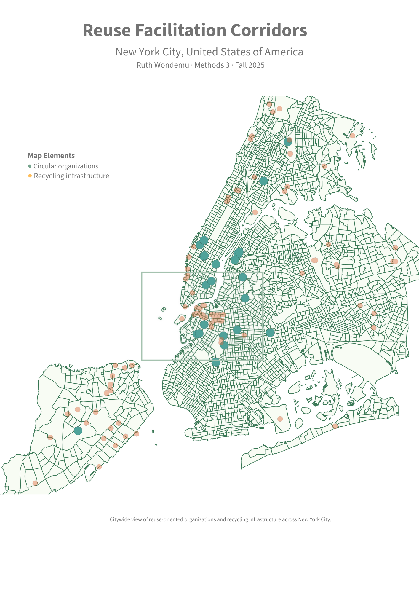
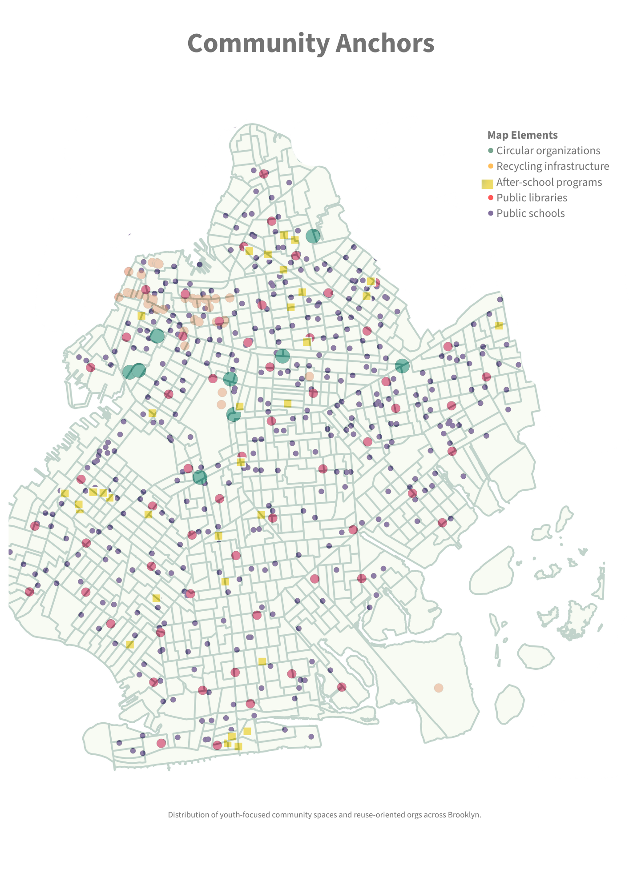
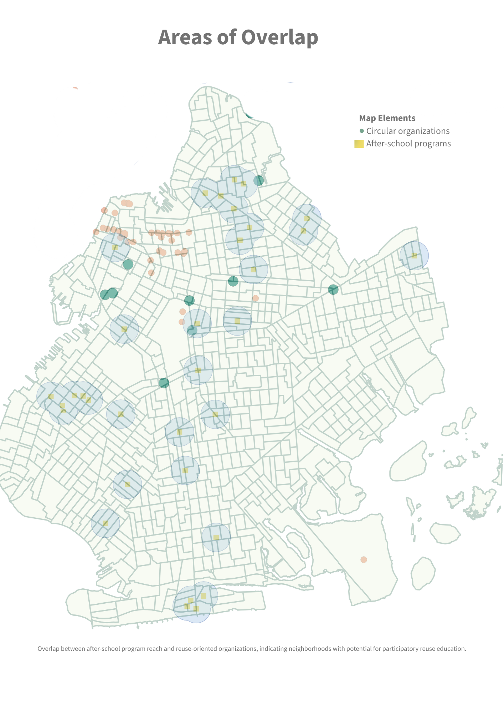
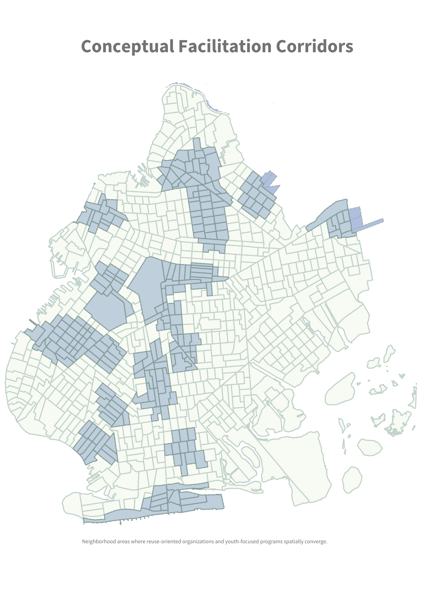

# Reuse Facilitation Corridors
Mapping where reuse initiatives and youth-centered spaces intersect across New York City.
## Overview
This project explores how youth-focused spaces such as schools, libraries, and after-school programs shape where learning and participation already happen. By mapping reuse-oriented organizations alongside these everyday sites, the project asks where reuse education and community engagement could become more visible and accessible.
## Methods
After-school programs are used as a proxy for youth participation at a neighborhood scale. Proximity is explored to suggest everyday access rather than formal service boundaries. Conceptual corridors are derived from areas of spatial overlap, highlighting where informal partnerships or shared programming might emerge.
## Data & Scope
This analysis does not capture all forms of reuse activity. Organizations without fixed locations, such as repair cafés, pop-up workshops, or informal community spaces, are not fully represented. These gaps point to opportunities for future expansion of this living map.
## Project Images

### Citywide Context

### Community Anchors

### Areas of Overlap

### Conceptual Facilitation Corridors

